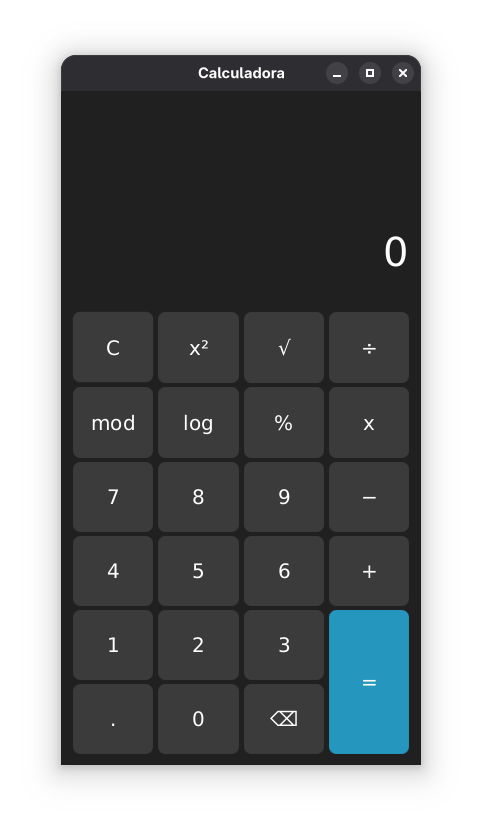

#  Calculadora Desktop com JavaFX

Este é um projeto de uma calculadora de desktop, construída com Java e JavaFX. A aplicação apresenta uma interface de usuário moderna, estilizada com CSS, e lida com operações aritméticas básicas e científicas.



---

## ✨ Funcionalidades Principais

O `CalculadoraController.java` gerencia toda a lógica de estado e operações, permitindo:

* **Operações Básicas:** Soma (`+`), Subtração (`-`), Multiplicação (`x`), Divisão (`÷`).
* **Operações Científicas:**
    * Potência (`x^y`)
    * Raiz Quadrada (`√`) - Suporta `√9` (3) e `5√9` (5 * 3 = 15).
    * Logaritmo (`log`) - Suporta `log 100` (2) e `5 log 100` (5 * 2 = 10).
    * Módulo/Resto (`mod`)
    * Porcentagem (`%`)
* **Histórico de Cálculos:** A interface exibe as três últimas operações completas (ex: `5 + 5 = 10`).
* **Gerenciamento de Estado:**
    * Permite operações contínuas (ex: `5 + 5 = 10`, e ao pressionar `+` novamente, o `10` é usado como primeiro operando).
    * A tela é limpa automaticamente ao digitar um novo número após um resultado ser exibido.
* **Controle de Entrada:**
    * Botão **"C"** (Limpar) para resetar todo o estado.
    * Botão **"←"** (Backspace) para apagar o último dígito.
* **Tratamento de Erros:** Exibe uma mensagem de erro na interface para operações inválidas, como divisão por zero.
* **Formatação Inteligente:** Resultados inteiros são exibidos sem o `.0` (ex: "10" em vez de "10.0").

---

## 🛠️ Tecnologias Utilizadas

* **Java (JDK 17+):** Linguagem principal da aplicação.
* **JavaFX:** Framework de UI para a construção da interface gráfica.
* **FXML:** Linguagem de marcação (XML) para definir a estrutura da interface de forma declarativa.
* **CSS:** Utilizado para a estilização personalizada (cores, fontes, botões) no arquivo `style.css`.

---

## 📂 Estrutura do Projeto

A lógica da aplicação está separada da interface, seguindo o padrão MVC (Model-View-Controller) facilitado pelo FXML.
```
calculadora-javafx/
├── .idea/
│   └── (arquivos de configuração da IDE)
├── .mvn/
│   └── (arquivos do Maven Wrapper)
├── src/
│   └── main/
│       ├── java/
│       │   └── org/example/calculadoracleber/
│       │       ├── CalculadoraApplication.java
│       │       ├── CalculadoraController.java
│       │       ├── Launcher.java
│       │       └── module-info.java
│       │
│       └── resources/
│           ├── css/
│           │   └── style.css
│           │
│           ├── imagens/
│               └── calculadora.png
│           │
│           └── org/example/calculadoracleber/
│               └── calculadora.fxml 
│  
│   
│
└── pom.xml        
```
---

## ▶️ Como Executar o Projeto

### Pré-requisitos

1.  **Java (JDK):** Versão 17 ou superior.
2.  **JavaFX SDK:** (Necessário caso sua JDK não a inclua).
3.  **IDE:** IntelliJ IDEA ou Eclipse (recomendado).

### Executando pela IDE

1.  Clone este repositório:
    ```sh
    git clone https://github.com/BrunoVerly/calculadora-javafx.git
    ```
2.  Abra o projeto na sua IDE (IntelliJ, Eclipse, etc.).
3.  Se você estiver usando Maven ou Gradle, aguarde a IDE baixar as dependências (incluindo as do JavaFX).
4.  Localize o arquivo `CalculadoraApplication.java`.
5.  Execute o método `main()` neste arquivo.

*(Se você não estiver usando Maven/Gradle, pode ser necessário configurar manualmente o `VM Options` na sua IDE para apontar para o `lib` do JavaFX SDK).*

---

## 🧠 Lógica Chave (CalculadoraController)

O controlador mantém o estado da calculadora usando variáveis como:

* `tipoOperaçao`: Armazena a operação pendente (ex: "somar", "dividir").
* `primeiroNumero`: Armazena o primeiro operando.
* `resultadoMostrado`: Uma `boolean` que controla se o valor na tela é um resultado final (para saber se deve limpar a tela no próximo clique de número).
* `resultadosAnteriores`: Um `ArrayList<String>` que guarda o histórico.

O método `igualOnAction()` é o cérebro principal, usando um `switch` em `tipoOperaçao` para executar o cálculo correto. Para obter o segundo número, ele usa `tela.getText().split("[operador]")`, o que exige que a entrada esteja formatada corretamente na tela.